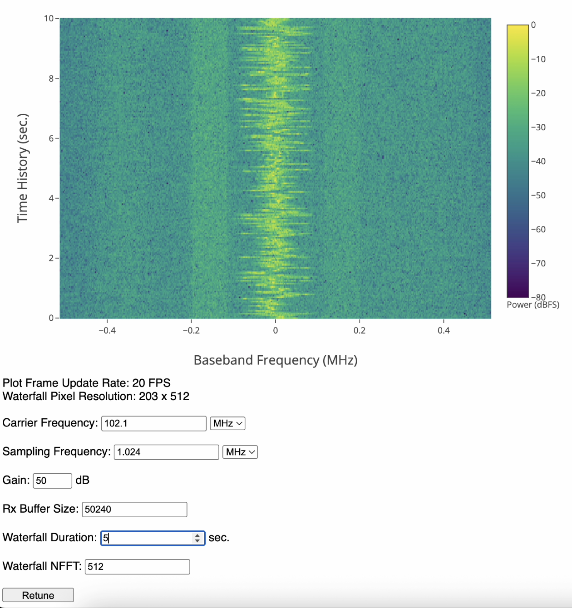

# Waterfall Visualization 




This repo houses a simple application for interfacing and visualizing with  
software-defined-radios (SDRs) through a web based application. A time-frequency  
waterfall of the RF spectrum is the core visualization realized in real-time  
alongside the radio tuning interface.

Differring generated waterfall resolutions and buffer update sizes will effect  
the performance of the frame update rate.

## Installation & Dependencies

This project uses [Poetry](https://python-poetry.org/) for dependency management for development and local environment setup. For `waterfall-viz` install, see the  
following `poetry` CLI command for environment install.

```bash
poetry install
```

Depending on your installed _Poetry_ version, the following command may be used to  
activate your installed _Poetry_ environment.

```bash
poetry activate
```

See documentation for further information.

## Radio Hardware support

To date, only the [RTL-SDR](https://www.rtl-sdr.com/) receiver is supported for use with the Waterfall  
Visualization interface.

## Usage

Once in the poetry environment, the python entrypoint `waterfall` can be used to  
start the application. See examples below.

```bash
waterfall --help # List application runner arguments.
waterfall -p 5005 # Start Flask application on port 5005.
```

